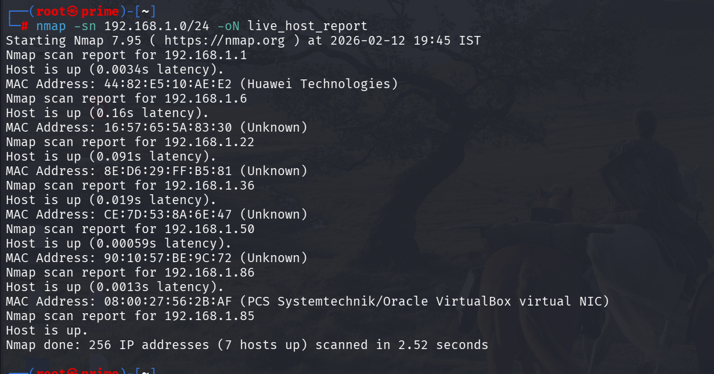
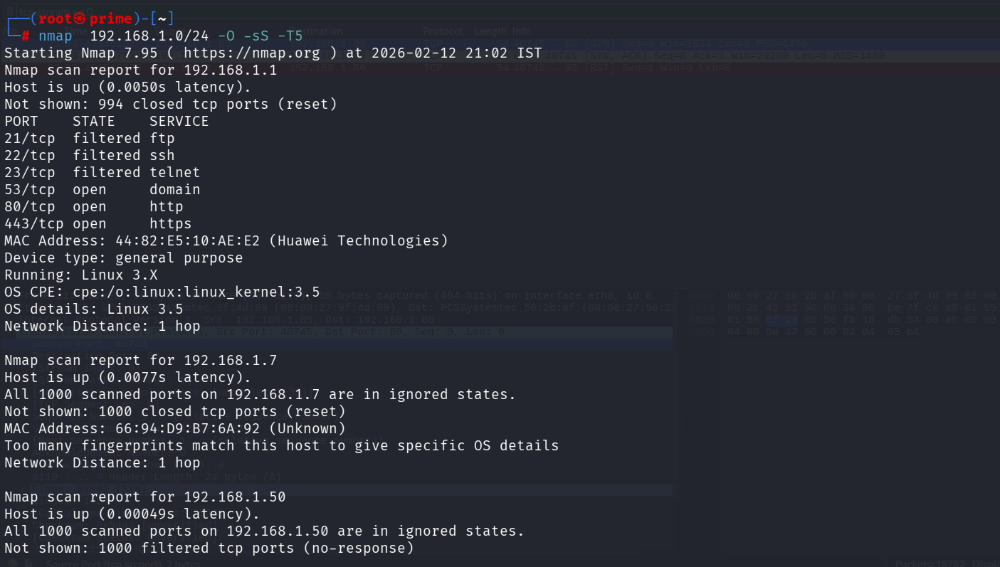
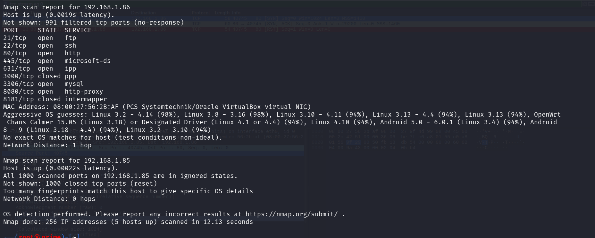
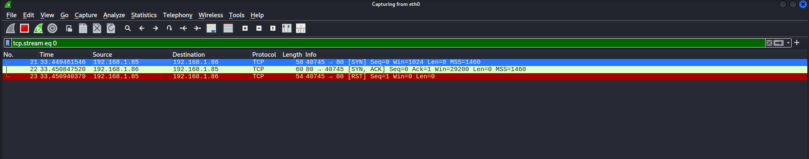

# task1-local-network-port-scan
Task 1 - Scan our  Local Network for Open Ports using Nmap


**Scan Scope Note**  
- Performed host discovery on the full local network (192.168.1.0/24) to identify live devices.  
- Conducted detailed TCP SYN + version scanning only on the intentionally vulnerable Metasploitable 3 VM (192.168.1.86), as it provides rich, educational exposure of services and risks. Normal home devices typically show minimal/no open ports.


---

#  Local Network Port Scanning – Cyber Security Internship Task

##  Objective

Discover open ports and services in my local network using Nmap and analyze potential security risks.

---

## 🛠 Tools Used
| Tool Name            | Description                                                                          | Purpose in Task                                                                 |
| -------------------- | ------------------------------------------------------------------------------------ | ------------------------------------------------------------------------------- |
| **Nmap**             | Open-source network scanning tool used for discovering hosts and open ports.         | Used to scan the local network and identify open ports and running services.    |
| **Wireshark**        | Network protocol analyzer that captures and analyzes network traffic in real time.   | Used to observe and analyze packets generated during the Nmap scan.             |
| **Kali Linux**       | Security-focused Linux distribution with pre-installed penetration testing tools.    | Used as the operating system to perform network scanning and analysis.          |
| **Metasploitable 3** | Intentionally vulnerable virtual machine designed for security testing and learning. | Used as a target machine to practice scanning and identify open ports/services. |


## 🌐 Step 1: Identify Local IP Range and active hosts

```
 command ip a of ifconfig(linux),ipconfig(windows)
```


Detected network range: `192.168.1.0/24`

---
## identify live host or active hosts:
```
command:nmap -sn 192.168.1.0/24 -oN live_hosts_report
```


active hosts:
192.168.1.1 

192.168.1.6 

192.168.1.22 

192.168.1.36 

192.168.1.50

192.168.1.86

192.168.1.85

## 🚀 Step 2: Perform TCP SYN Scan for open ports on active hosts one by one
TCP SYN Scan: It sends a SYN packet and waits for a SYN-ACK response without completing the full handshake.after receiving syn+ack packets,it's send reset packet and does not complete three way handshake that's make it faster and stealth
                                        



---
target:192.168.1.86 metasploitalble 3
finding open ports and  running service version detection
 

---
#syn-scan result
## 📊 Detailed Port Analysis on metasploitable 3 ubuntu version

| Port     | Protocol | State | Service        | Version / Product / Details                                              | Potential Risk Level | Common Vulnerability / Exploit Notes |
|----------|----------|-------|---------------|-------------------------------------------------------------------------|----------------------|--------------------------------------|
| 21/tcp   | tcp      | open  | ftp           | vsftpd 3.0.3 (or similar)                                              | High                 | Anonymous login often enabled; backdoor in older versions |
| 22/tcp   | tcp      | open  | ssh           | OpenSSH 7.4p1 Ubuntu 10 (or similar)                                   | Medium-High          | Brute-force possible; weak keys if default config |
| 23/tcp   | tcp      | open  | telnet        | Linux telnetd                                                           | Critical             | Clear-text credentials; easy sniffing |
| 80/tcp   | tcp      | open  | http          | Apache httpd 2.4.x (DVWA, Mutillidae etc.)                             | High                 | XSS, SQLi, command injection, file upload vulnerabilities |
| 139/tcp  | tcp      | open  | netbios-ssn   | Samba smbd 4.x (or 3.x)                                                 | High                 | Null sessions, weak authentication, EternalBlue-style exploits |
| 445/tcp  | tcp      | open  | microsoft-ds  | Samba smbd 4.x / Windows SMB                                            | Critical             | MS17-010 (EternalBlue), WannaCry, credential relay |
| 3306/tcp | tcp      | open  | mysql         | MySQL 5.5.x – 5.7.x                                                     | High                 | Weak/default credentials; SQL injection |
| 5432/tcp | tcp      | open  | postgresql    | PostgreSQL Database                                                     | Medium-High          | Default credentials; SQL injection if exposed |
| 8009/tcp | tcp      | open  | ajp13         | Apache JServ Protocol (Tomcat integration)                              | High                 | Ghostcat (CVE-2020-1938) file read/inclusion |
| 8180/tcp | tcp      | open  | http-proxy    | Apache Tomcat Manager Interface                                         | Critical             | Default Tomcat credentials → Remote Code Execution |
| Others*  | tcp      | open  | Various       | IRC (6667), VNC (5900), Redis (6379), etc. (if present)                | High-Critical        | Unauthenticated access, RCE, data exposure |


Perfect 👍 now I can clearly see all active hosts from your full scan.

Based on your screenshot (`nmap 192.168.1.0/24 -O -sS -T5`), here is the **complete summary table of active hosts and their open ports** 👇

---

## 📊 Local Network Active Hosts Summary

| Host IP          | Status | Open Ports                       | Services                                    | OS Detection                              | Risk Level |
| ---------------- | ------ | -------------------------------- | ------------------------------------------- | ----------------------------------------- | ---------- |
| **192.168.1.1**  | Up     | 53, 80, 443                      | DNS, HTTP, HTTPS                            | Linux 3.x (Huawei device – likely Router) | Medium     |
| **192.168.1.7**  | Up     | None (1000 closed)               | No exposed services                         | OS not identified                         | Low        |
| **192.168.1.50** | Up     | None (1000 filtered)             | No visible services                         | OS not identified                         | Low        |
| **192.168.1.85** | Up     | None (1000 closed)               | No exposed services                         | OS not identified                         | Low        |
| **192.168.1.86** | Up     | 21, 22, 80, 445, 631, 3306, 8080 | FTP, SSH, HTTP, SMB, IPP, MySQL, HTTP-Proxy | Linux (3.x–4.x)                           | 🔴 High    |

---

## 🔎 Network Overview

* Total IPs scanned: **256**
* Active hosts found: **5**
* Hosts with exposed services: **2 (192.168.1.1 and 192.168.1.86)**
* Most exposed machine: **192.168.1.86 (Metasploitable VM)**
* Router detected at: **192.168.1.1 (Huawei device)**

---

## 🚨 Risk Analysis

### 🔹 192.168.1.1 (Router)

* DNS, HTTP, HTTPS open
* Web management interface exposed
* Should restrict admin panel access

### 🔹 192.168.1.86 (Vulnerable VM)

* Multiple critical services exposed
* SMB + FTP + MySQL increases attack surface
* High exploitation probability

---

## wireshark syn scan analysis with nmap syn scan on port 80


## ⚠️ Security Risks Identified

* Open SSH port → password brute force
* Open SMB → lateral movement risk
* Web service → possible misconfiguration

---

## 🔐 How to Secure Open Ports

* Enable firewall
* Close unused ports
* Disable unnecessary services
* Use strong passwords
* Regular patching

---

## 📡 Wireshark Analysis

Captured SYN packets to observe TCP handshake behavior.

Screenshot included in `/screenshots`.

---

## 🎓 Interview Questions & Answers

1. **What is an open port?**  
An open port is a network port that is actively accepting incoming connections.

2. **How does Nmap perform a TCP SYN scan?**  
Nmap sends a SYN packet and waits for a SYN-ACK response. If received, the port is open, and Nmap sends a RST packet instead of completing the handshake.

3. **What risks are associated with open ports?**  
Open ports may expose vulnerable services that attackers can exploit for unauthorized access.

4. **Explain the difference between TCP and UDP scanning.**  
TCP scanning targets connection-oriented services, while UDP scanning targets connectionless services and is generally slower.

5. **How can open ports be secured?**  
By using firewalls, disabling unnecessary services, restricting access, and applying regular updates.

6. **What is a firewall's role regarding ports?**  
A firewall controls incoming and outgoing network traffic and blocks unauthorized access to ports.

7. **What is a port scan and why do attackers perform it?**  
A port scan is a reconnaissance technique used to discover open ports and services. Attackers use it to identify potential entry points.

8. **How does Wireshark complement port scanning?**  
Wireshark allows packet-level analysis to understand how network communication and scanning techniques work.


---

## Conclusion & Learning Outcomes
- Gained hands-on experience with Nmap for host discovery and stealthy TCP SYN scanning.
- Understood how open ports expose services (especially on vulnerable systems like Metasploitable 3).
- Learned to identify risks from common services (e.g., Telnet clear-text, SMB exploits, weak web apps).
- Realized the value of limiting deep scans to specific targets and using tools like Wireshark for packet verification.
- Key takeaway: Minimize unnecessary open ports and always patch/secure services — even in home/lab networks.


