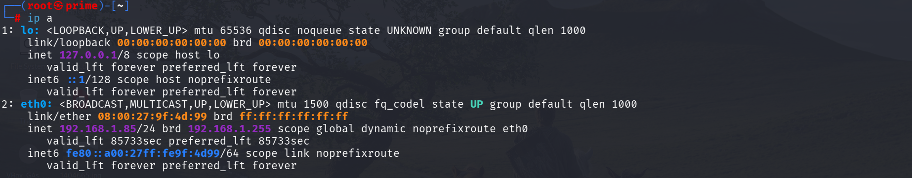
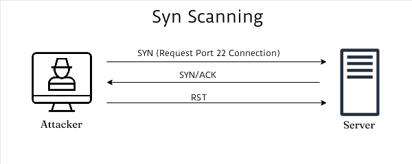
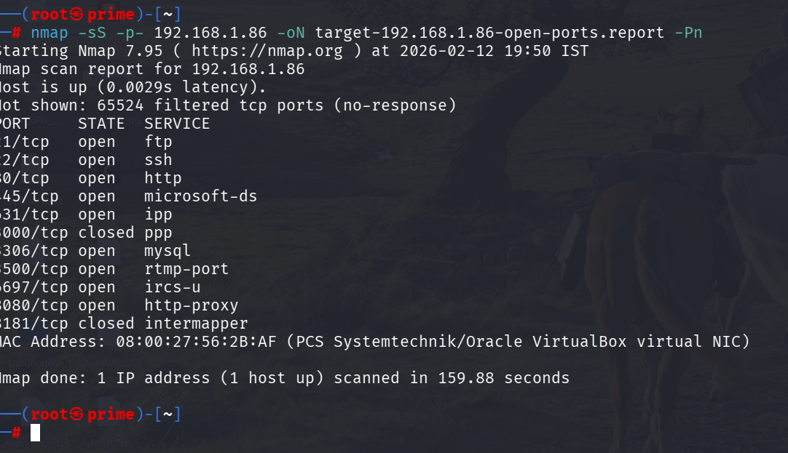
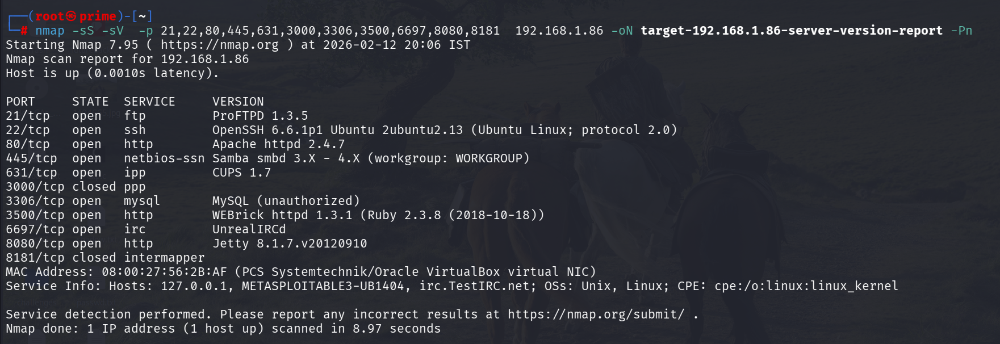

# task1-local-network-port-scan
Task 1 - Scan Your Local Network for Open Ports using Nmap


---

#  Local Network Port Scanning – Cyber Security Internship Task

##  Objective

Discover open ports and services in my local network using Nmap and analyze potential security risks.

---

## 🛠 Tools Used
| Tool Name            | Description                                                                          | Purpose in Task                                                                 |
| -------------------- | ------------------------------------------------------------------------------------ | ------------------------------------------------------------------------------- |
| **Nmap**             | Open-source network scanning tool used for discovering hosts and open ports.         | Used to scan the local network and identify open ports and running services.    |
| **Wireshark**        | Network protocol analyzer that captures and analyzes network traffic in real time.   | Used to observe and analyze packets generated during the Nmap scan.             |
| **Kali Linux**       | Security-focused Linux distribution with pre-installed penetration testing tools.    | Used as the operating system to perform network scanning and analysis.          |
| **Metasploitable 3** | Intentionally vulnerable virtual machine designed for security testing and learning. | Used as a target machine to practice scanning and identify open ports/services. |


## 🌐 Step 1: Identify Local IP Range and active hosts

```
 command ip a of ifconfig(linux),ipconfig(windows)
```


Detected network range: `192.168.1.0/24`

---
## identify live host or active hosts:
```
command:nmap -sn 192.168.1.0/24 -oN live_hosts_report
```


## 🚀 Step 2: Perform TCP SYN Scan on target machine (metasploitable 3 ubuntu version intentionaly vulnerable best for home pentesting)
TCP SYN Scan: It sends a SYN packet and waits for a SYN-ACK response without completing the full handshake.after receiving syn+ack packets,it's send reset packet and does not complete three way handshake that's make it faster and stealth



```
finding open ports
nmap -sS -p- 192.168.1.86 -oN target-192.168.1.86-open-port-reports
```



---
 running service version detection
 

---
#syn-scan result


## ⚠️ Security Risks Identified

* Open SSH port → password brute force
* Open SMB → lateral movement risk
* Web service → possible misconfiguration

---

## 🔐 How to Secure Open Ports

* Enable firewall
* Close unused ports
* Disable unnecessary services
* Use strong passwords
* Regular patching

---

## 📡 Wireshark Analysis

Captured SYN packets to observe TCP handshake behavior.

Screenshot included in `/screenshots`.

---

## 🎓 Interview Questions & Answers

(Add all 8 answers here neatly)

---

## 📚 Key Concepts Learned

* TCP SYN Scan
* Network Reconnaissance
* Port Exposure
* Basic Security Hardening

---


